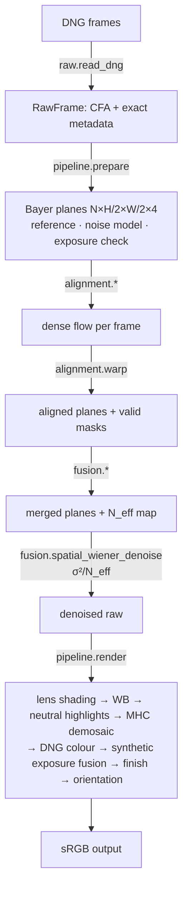

# Architecture

HIE v0.1 is a Python research engine. Every stage is a small, testable function operating on
float32 arrays in a **normalised linear raw domain** (black = 0, sensor white = 1). That is the
domain in which the DNG `NoiseProfile` model `var = S·x + O` holds directly.

## Modules

| Package | Responsibility | Key choices |
|---|---|---|
| `raw` | DNG decoding, Bayer planes, GainMap opcodes | pixels via LibRaw; **tags via tifffile**, because LibRaw rounds fractional black levels; canonical plane order `R, Gr, Gb, B` for any CFA phase |
| `noise` | Poisson–Gaussian model; estimators from a burst and from a single image | chi-square bias correction; estimation on flat pixels only |
| `alignment` | `none`, `phase_correlation`, `feature_homography` (ORB + RANSAC), `dis_flow`, `hdrplus_tiles` | every aligner returns a dense flow with one shared convention |
| `fusion` | mean, median, sharpness-weighted, motion-aware, confidence, temporal Wiener (HDR+ reproduction); tile machinery | all consume pre-warped frames, so aligners and merges combine freely |
| `confidence` | noise-normalised residual D², saturation, effective frame count | per-pixel `N_eff` is carried to the denoiser |
| `demosaic` | MHC (default), bilinear, OpenCV edge-aware | CFA-phase-safe border handling |
| `color` | DNG-spec camera→sRGB (CCT iteration, Bradford), colour spaces | ForwardMatrix when present; Google `rgb2rgb` selectable |
| `tone_mapping` | synthetic exposure fusion, fixed and global modes | fuses luminance only, so hue is kept |
| `finish` | guided-filter chroma denoise, cored luma sharpening | restrained defaults ("natural > oversharpened") |
| `datasets` | HDR+ loader and downloader, DNG folders, synthetic bursts, inspection | loader never drops frames silently |
| `metrics` | PSNR, SSIM, MS-SSIM, CIEDE2000, detail retention, Immerkær noise, reference deviation | CIEDE2000 reproduces Sharma's test pairs exactly |
| `bench`, `report` | EXP suites, never-overwritten run directories, HTML comparison report | each run records its commit, dirty flag, parameters and environment |
| `hdr`, `super_resolution` | placeholders with the plan (v0.4, v0.5) | no code yet |

## Tile aligner (as implemented)

- **Pyramid**: 5 levels on the 2×2-averaged gray, with factors 1, 2, 2, 2, 4 (fine → coarse) and tiles of 16 px (8 at the coarsest level). A level is dropped when it cannot hold 2×2 tiles.
- **Search per level**: radius 1, 2, 2, 2, 4 around a prior, using L1 at the finest level and L2 elsewhere. The prior is the best of three candidates propagated from the coarser level: the enclosing tile and its nearest neighbours, as in HDR+.
- **Sub-pixel refinement at every level**: a separable parabola fit on L2 costs, carried fractionally to the next level so priors are rounded only once.
- **Noise-aware acceptance**: a tile leaves its prior only when the cost improvement exceeds 3σ of the noise-only cost difference. That σ comes from the noise model, measured pyramid variance factors and a correlation-inflation factor.
- **Output**: tile displacements are bilinearly interpolated into a dense flow.

## Design principles carried from the brief

- *Recover before hallucinating*: every stage in v0.1 is levels 1–2 of the brief's hierarchy (physics and mathematical reconstruction). There are no learned or generative components.
- *Interpretable*: every merge exposes its weights or its N_eff, and every run records its configuration.
- *Deployable later*: the algorithms are local and tile-based, which suits Halide, Vulkan or NDK ports. The Python timings (~10–35 s per 12 MP burst) are research-reference numbers, not phone numbers.
